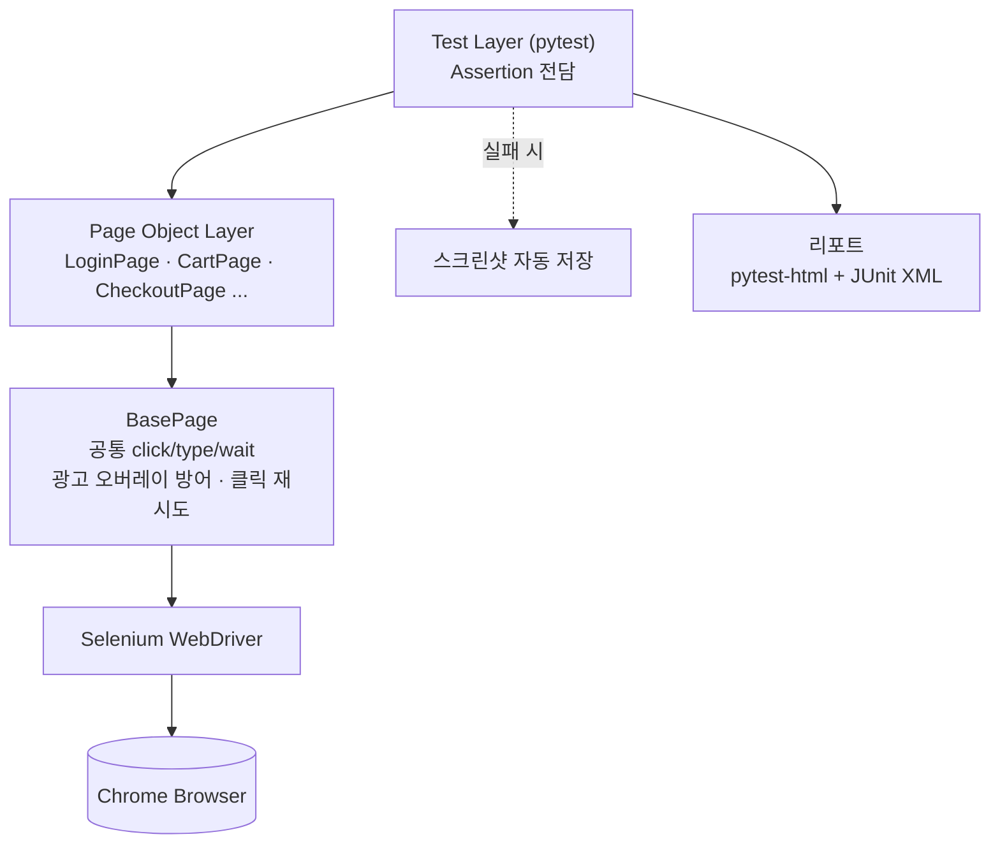

<div align="center">

# QA Automation Portfolio - 이인규

**CI/CD 기반 QA의 전체 프로세스를 AI agent가 실행하며 사람이 판단,통제하는 자동화 프로젝트**
                   
  업무 리소스 **개선**, 품질 **향상**, 프로세스 **효율화**
            
[](https://github.com/Matthaeus888/qa-automation-portfolio/actions/workflows/ci.yml)


[이슈 리포트](./docs/defects/README.md) · [트러블슈팅](./docs/troubleshooting/) · [AI 에이전트 설계](./docs/AI_AGENTS.md)

</div>

---

## 프로젝트 소개

1.이커머스 연습 사이트의 7개 기능(로그인/로그아웃, 회원가입/계정삭제, 상단 네비게이션, 상품 검색, 장바구니, 상품 상세, 페이지 UI)에 걸쳐 76건의 Test Case를 자동화(Selenium + pytest + Page Object Model)했습니다.
테스트 자동화 과정에서 실제 결함 2건을 발견하고 재현 절차·근본 원인까지 분석해 이슈 리포트를 생성했습니다. → [이슈 리포트 보기](./docs/defects/README.md)

2.이커머스 연습 사이트[(automationexercise.com)](https://automationexercise.com)를 대상으로, PRD 작성 → TC 설계/작성 → 자동화 대상 선정 및 계획 → 코드 구현 → CI/CD(자동화 테스트 포함) → Slack 알림과 Google sheet에 결과 작성까지 QA 프로세스 전체를 설계·구현했습니다.

3.요구사항 작성, TC 작성, 자동화 선별, 계획, 자동화 작성 AI agent를 생성해서 각 단계별로 역할을 나눠 맡되, 사람의 최종 승인이 필요한 지점(요구사항 확정, 자동화 대상 선정, 코드 저장, 코드 업로드)에서는 사람 승인을 받아야만 다음 단계로 넘어가도록 강제했습니다(CLAUDE.md)

4.Github Aaction으로 매일 정해진 시간에 테스트를 실행해 테스트 실패 여부를 Slack 및 Google sheet로 확인 가능하게 구현 했습니다.
기본 기능에 대한 지속적인 품질 체크가 가능하며 모든 단계의 산출물을 Google doc와 sheet로 자동으로 작성해, 신규 업데이트 시 이력 관리 와 유지보수가 편리하게 구현 했습니다.  

5.CI의 마지막 단계에 pip-audit 의존성 보안 점검을 통해 민감한 보안 정보 체크와 토큰 절약을 위한 불필요한 CI 실행 제거, AI 에이전트의 CI 모니터링 폴링을 진행했습니다.[ci-token-efficiency.md](./docs/troubleshooting/ci-token-efficiency.md)

## 실행 결과
**테스트 자동화 CI/CD 정의** 

CI : 테스트 스크립트 문법 검사 & 테스트 자체의 정상 작동 여부 검증

CD : 최신 테스트 스크립트 실행 + Google Sheets / Slack 등으로 최종 테스트 결과 데이터 자동 전달


실제 로그인/로그아웃 기능(TC-LOGIN-LOGOUT) 자동화 스위트를 실행한 결과입니다(스크린샷이 아닌 실제 실행 로그 발췌).

```text
$ pytest tests/test_login.py -v
tests/test_login.py::test_login_page_shows_login_and_signup_sections PASSED
tests/test_login.py::test_navigate_to_login_via_top_navigation PASSED
tests/test_login.py::test_navigate_to_login_via_direct_url PASSED
tests/test_login.py::test_login_with_valid_credentials_lands_on_home PASSED
tests/test_login.py::test_login_with_nonexistent_email_shows_error PASSED
tests/test_login.py::test_login_with_wrong_password_shows_same_error PASSED
tests/test_login.py::test_login_redirects_to_home_when_reentering_login_page PASSED
tests/test_login.py::test_login_state_persists_after_refresh PASSED
tests/test_login.py::test_login_with_long_special_char_input_shows_error PASSED
tests/test_login.py::test_logout_via_top_navigation FAILED
tests/test_login.py::test_logout_via_direct_url PASSED

================== 1 failed, 10 passed in 100.17s (0:01:40) ==================
```

10건은 정상 통과했고, 실패한 1건은 자동화 코드 결함이 아니라 **실제 대상 사이트의
세션 처리 결함**으로 판정해 정식 리포트로 남겼습니다 → [DEF-001 상세 보기](./docs/defects/DEF-001-logout-session-not-terminated.md)

[테스트 완료 - CD 산출물(Google sheet)]


[테스트 완료 - CD 산출물(Slack Webhook)]


[테스트 완료 - CD 산출물(이슈 리포트)


## 이 프로젝트로 증명하는 역량

| 영역 | 무엇을 했는가 | 근거 |
|---|---|---|
| **요구사항 분석 · PRD 작성** | 실제 사이트 동작을 확인하며 Project/Feature PRD 7건 작성, 실측과 다른 부분은 발견 즉시 재승인 절차로 수정 | [docs/prd/](./docs/prd/) |
| **Test Case 설계** | Priority(P0~P2)를 Impact×Likelihood Risk Score로 정량 산정, 결함 의심 항목은 별도 섹션으로 분리 | [docs/tc/](./docs/tc/) |
| **자동화 대상 선정** | Business Criticality·회귀 빈도·자동화 안정성 등 6축 정량 평가(Automation Score)로 자동화 여부 판단 | [docs/tc/automation-judge/](./docs/tc/automation-judge/) |
| **테스트 자동화 구현** | Selenium + pytest + Page Object Model, 공통 Wait/재시도 로직을 `BasePage`로 추상화 | [automation/](./automation/) |
| **결함 발견·분석 능력** | 실제 프로덕션 결함 2건을 재현 절차·근본 원인·판정 근거까지 갖춘 정식 리포트로 기록 | [docs/defects/](./docs/defects/) |
| **CI/CD 파이프라인 구축** | GitHub Actions로 push/스케줄/수동 실행 3가지 트리거, headless Chrome, Artifact 업로드 | [.github/workflows/ci.yml](./.github/workflows/ci.yml) |
| **문제 해결 능력** | 제3자 광고 오버레이 간섭, headless 환경 결함, CI 조건식 논리 오류 등 실전 이슈 해결 | [docs/troubleshooting/](./docs/troubleshooting/) |
| **보안 점검(Shift-Left)** | `pip-audit`으로 의존성 취약점을 Push 전 로컬 + CI 양쪽에서 점검, 사람이 검토할 Markdown 리포트로 산출 | [scripts/security_check/](./scripts/security_check/) |

## 🔄 QA 프로세스

```mermaid
flowchart LR
    A[요구사항] --> B[PRD 작성]
    B -->|"승인 ✅"| C[Test Case 작성]
    C -->|"자동화 대상 선정 승인 ✅"| D[개발 Roadmap 작성]
    D --> E[자동화 코드 구현]
    E --> F[테스트 실행 · 결과 검증]
    F --> G[코드 리뷰]
    G -->|"Commit 승인 ✅"| H[Git Commit]
    H -->|"Push 승인 ✅"| I[Git Push]
    I --> J[GitHub Actions CI]
    J --> K[Slack 결과 알림]

    style B fill:#e8f0fe
    style C fill:#e8f0fe
    style D fill:#e8f0fe
    style H fill:#fde8e8
    style I fill:#fde8e8
```



✅ 표시는 **사람의 명시적 승인이 있어야만** 다음 단계로 진행되는 지점입니다. 이 게이트를
Sub Agent 5종의 역할 분리와 함께 어떻게 설계했는지는 [AI 에이전트 설계 문서](./docs/AI_AGENTS.md)에서 자세히 다룹니다.

## 자동화 아키텍처 (Page Object Model)



- **Page Layer는 조작/조회만, Assertion은 Test Layer가 전담** — 화면 변경 시 Page
  클래스만 수정하면 되도록 관심사를 분리했습니다.
- 모든 Page Object가 `BasePage`를 상속해, 광고 오버레이 방어·클릭 재시도 로직을
  한 곳에서만 구현하고 전체에 일관 적용합니다(상세: [트러블슈팅 문서](./docs/troubleshooting/ad-overlay.md)).
- Playwright MCP는 코드를 작성하기 전, 실제 페이지의 Locator(선택자)와 동작을
조회 전용으로 미리 확인하는 개발 보조 도구로만 사용했다(AUTOMATION_GUIDE 5절
"실제 페이지 탐색 절차"). 예를 들어 특정 버튼의 data-qa 속성이 무엇인지, 장바구니
합계가 실제로 얼마로 계산되는지를 코드 작성 전에 실측으로 검증하고, 그 근거(날짜·URL)를
코드 주석에 남겼다. 실제 클릭·입력 등 테스트 동작 자체를 수행하는 것은 전부 Selenium WebDriver다.

## 발견한 결함

| ID | 제목 | 심각도 |
|---|---|---|
| [DEF-001](./docs/defects/DEF-001-logout-session-not-terminated.md) | `/logout` 접근 시 서버 세션이 종료되지 않고 로그인 상태로 Home에 랜딩 | High |
| [DEF-002](./docs/defects/DEF-002-logout-server-error-disclosure.md) | 로그아웃 상태에서 `/logout` 접근 시 Django 디버그 에러 페이지 노출(정보 노출) | Medium |

각 리포트에는 재현 절차, 기대/실제 결과, 스크린샷 증거, 근본 원인 추정, 그리고
**"자동화 코드 문제가 아님을 어떻게 배제했는가"** 판정 근거가 포함되어 있습니다.

## 트러블슈팅 사례

| 문서 | 내용 |
|---|---|
| [ad-overlay.md](./docs/troubleshooting/ad-overlay.md) | 제3자 광고 오버레이의 클릭 가로채임 대응 — 잘못된 최적화가 오히려 회귀를 유발했던 경험 포함 |
| [flaky-tests.md](./docs/troubleshooting/flaky-tests.md) | headless 전용 결함, CI 조건식 논리 오류, "알려진 결함"과 "새로운 결함" 구분 원칙 |
| [ci-secrets-setup.md](./docs/troubleshooting/ci-secrets-setup.md) | 저장소 이전 후 CI 반복 실패 진단기 — 관리자 인증 없이 간접 신호만으로 원인을 좁혀 GitHub Secrets 설정 실수(Name/Value 혼동)를 찾아낸 과정 |
| [ci-token-efficiency.md](./docs/troubleshooting/ci-token-efficiency.md) | 토큰 절약을 위한 아이디어와 구현 — `paths-ignore`/`concurrency`로 불필요한 CI 실행 제거, AI 에이전트의 CI 모니터링 폴링 전략 개선 |

## 의존성 보안 점검

Push 자동화가 아니라 **판단을 사람에게 맡기는 보안 점검**을 추가했습니다.

- `scripts/security_check/run_security_check.py`가 `pip-audit`으로
  `automation/`, `scripts/notify_slack/`, `scripts/sheets_sync/`의
  `requirements.txt`를 점검하고, 취약점 ID·수정 버전·설명이 정리된 Markdown
  리포트를 생성합니다.
- **로컬**: Git Push를 승인받기 직전에 실행해 리포트를 먼저 검토하는 용도.
- **CI**: 매 실행마다 동일한 스크립트를 돌리고 리포트를 `security-report`
  Artifact로 업로드합니다. `continue-on-error: true`로 설정해 취약점이
  발견돼도 CI Job 자체를 실패시키지는 않습니다 — 이 스크립트는 Git 명령을
  전혀 실행하지 않으며, 취약점이 있어도 Commit/Push 여부는 항상 사람이
  결정합니다([CLAUDE.md 14·18절](./CLAUDE.md)).

## AI 에이전트 기반 개발

이 프로젝트는 Claude Code 기반 **Sub Agent 5종**(PRD 작성 → TC 작성 → 자동화 대상
선정 → Roadmap 작성 → 자동화 구현)으로 역할을 분리하고, Commit·Push·자동화 대상
확정 등 주요 의사결정 지점마다 **사람의 명시적 승인**을 강제하는 구조로 설계했습니다.
AI가 무엇을 자율적으로 하고 무엇은 반드시 사람이 결정하도록 설계했는지, 실제로
산출물 간 충돌이 발생했을 때 어떻게 처리했는지는 [`docs/AI_AGENTS.md`](./docs/AI_AGENTS.md)에서 확인할 수 있습니다.

사람이 승인한 산출물(PRD·Roadmap)은 [`scripts/docs_sync`](./scripts/docs_sync/)로 Google
Docs에, TC·자동화 대상 선정 결과는 [`scripts/sheets_sync`](./scripts/sheets_sync/)로 Google
Sheets에 각각 반영되어, 팀원이 저장소를 열지 않고도 최신 산출물을 확인할 수 있습니다.

## 테스트 현황

| Feature | 승인된 TC 수 | 자동화 여부 |
|---|---|---|
| 로그인/로그아웃 | 11 | ✅ 전건 자동화 |
| 회원가입/계정삭제 | 11 | ✅ 전건 자동화 |
| 상단 네비게이션 | 6 | ✅ 전건 자동화 |
| 상품 검색 | 8 | ✅ 전건 자동화 |
| 장바구니 | 13 | ✅ 전건 자동화 |
| 상품 상세 | 6 | ✅ 전건 자동화 |
| 페이지별 UI | 21 | ✅ 전건 자동화 |
| **합계** | **76** | **79개 pytest 케이스**(일부 TC는 파라미터화로 확장 실행) |

## 실행 방법

```bash
cd automation
pip install -r requirements.txt
cp .env.example .env   # ACTEST1~3_PASSWORD 값을 채운 뒤 사용 (git에 커밋하지 않음)

pytest tests/                                         # 전체 실행
pytest tests/test_login.py                            # 파일 단위 실행
pytest tests/test_cart.py::test_add_to_cart_shows_modal  # 단일 테스트 실행
```

리포트는 `automation/reports/`(HTML + JUnit XML), 실패 시 스크린샷은
`automation/screenshots/`에 저장됩니다(둘 다 git 미추적).

### CI/CD

[`.github/workflows/ci.yml`](./.github/workflows/ci.yml)이 아래 조건에서 전체 테스트를
headless Chrome으로 실행하고, 실패 시에만 Slack으로 알립니다.

- `master` 브랜치 push 시
- 매일 한국시간(KST) 오전 9시 스케줄 실행
- GitHub Actions 탭에서 수동 실행(workflow_dispatch)

## 프로젝트 구조

```
qa-automation-portfolio/
├── docs/
│   ├── prd/                        # Project/Feature PRD
│   ├── tc/                         # Test Case + 자동화 대상 선정 결과
│   ├── roadmap/ROADMAP.md          # 자동화 개발 Roadmap 및 진행 현황
│   ├── automation/AUTOMATION_GUIDE.md  # 자동화 코드 개발 기준
│   ├── defects/                    # 발견한 결함 정식 리포트
│   ├── troubleshooting/            # 실전 문제 해결 사례
│   └── AI_AGENTS.md                # AI 에이전트 역할 분리·승인 게이트 설계
├── automation/                     # Selenium + pytest 자동화 코드 (POM)
│   ├── pages/                      # Page Object (화면별 1클래스, BasePage 상속)
│   ├── tests/                      # pytest 테스트 (Assertion 전담)
│   ├── config/, utils/, test_data/
│   └── conftest.py, requirements.txt, pytest.ini
├── scripts/
│   ├── notify_slack/                # CI 실패 시 Slack Webhook 알림
│   ├── sheets_sync/                 # TC/자동화 대상 선정 ↔ Google Sheets 연동
│   ├── docs_sync/                   # PRD/Roadmap → Google Docs 연동
│   └── security_check/              # pip-audit 의존성 보안 점검 (로컬+CI)
├── .github/workflows/ci.yml        # GitHub Actions CI
├── .claude/agents/, .claude/skills/ # Sub Agent / Skill 정의
└── CLAUDE.md                       # 프로젝트 최상위 지침 (Source of Truth)
```

## 상세 문서

- [`CLAUDE.md`](./CLAUDE.md) — 프로젝트 전체 워크플로우·원칙 (Source of Truth 최상위)
- [`docs/AI_AGENTS.md`](./docs/AI_AGENTS.md) — AI 에이전트 역할 분리, 승인 게이트, 실제 충돌 사례
- [`docs/defects/`](./docs/defects/) — 발견한 결함 정식 리포트
- [`docs/troubleshooting/`](./docs/troubleshooting/) — 실전 문제 해결 사례
- [`docs/roadmap/ROADMAP.md`](./docs/roadmap/ROADMAP.md) — 자동화 개발 Roadmap 및 진행 현황
- [`docs/automation/AUTOMATION_GUIDE.md`](./docs/automation/AUTOMATION_GUIDE.md) — 자동화 코드 개발 기준
- [`scripts/security_check/README.md`](./scripts/security_check/README.md) — 의존성 보안 점검(pip-audit) 사용법과 설계 원칙

## 기술 스택

| 항목 | 선택 |
|---|---|
| 언어 | Python (자동화 코드 한정 PEP8: 4칸 들여쓰기, snake_case) |
| 자동화 도구 | Selenium WebDriver |
| 테스트 러너 | pytest |
| 개발 보조 도구 | Playwright |
| 설계 패턴 | Page Object Model |
| 리포팅 | pytest-html + JUnit XML |
| CI/CD | GitHub Actions |
| 보안 점검 | pip-audit (의존성 취약점, 로컬+CI) |
| 알림 | Slack (CI 결과 알림 전용) |
| 협업 도구 | Google Sheets (TC/자동화 대상 관리), Google Docs (PRD/Roadmap 공유), Claude Code Sub Agent |

[MIT](./LICENSE)
